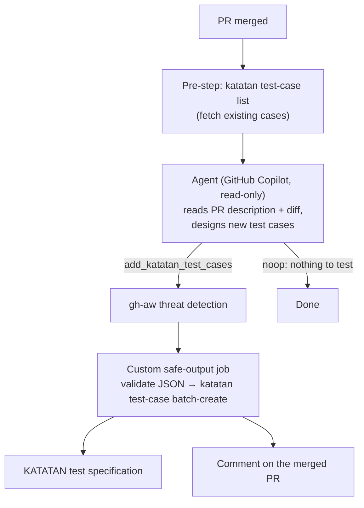

# Auto-Writing Test Specs with KATATAN × GitHub Agentic Workflows

A sample repository showing how to keep a [KATATAN](https://katatan.com) test specification up to date automatically.
When a pull request is merged, an AI agent reads what the PR implemented, designs manual test cases for it,
and appends them to a KATATAN test specification. It then comments the list of added cases on the PR.

The whole setup is a single workflow file:
[`.github/workflows/katatan-testspec-from-pr.md`](.github/workflows/katatan-testspec-from-pr.md).
It is written for [GitHub Agentic Workflows (gh-aw)](https://github.github.com/gh-aw/) and runs on the default
GitHub Copilot engine. Copy it into your own repository to try it.

## How it works



1. **Trigger**: `pull_request` `closed` with `merged == true`. You can also run it manually with `workflow_dispatch` and a PR number.
2. **Pre-step**: [`@katatan/cli`](https://www.npmjs.com/package/@katatan/cli) fetches the existing test cases in the target specification.
   The agent uses them to avoid writing duplicates.
3. **Agent**: GitHub Copilot reads the PR title, description, changed files, and diff through the GitHub MCP server.
   It then designs test cases that cover the normal path, error handling, and boundary values.
   It submits all cases in one call to the `add_katatan_test_cases` tool.
   If the PR has nothing to test, such as docs or CI changes, it calls `noop` instead.
4. **Custom safe-output job**: runs after gh-aw's threat detection. It does three things:
   - validates the cases against KATATAN's limits
   - appends them with `katatan test-case batch-create`
   - posts a summary comment on the PR

Example PR comment:

> ### 🧪 KATATAN test cases added
>
> Covers the new argument validation in the greeting script.
>
> 2 test case(s) were appended to the test specification `<projectId>.<specId>`.
>
> | Case | Test subject | Steps |
> | --- | --- | --- |
> | case-12 | Greeting fails when no name is given | 2 |
> | case-13 | Greeting prints the given name | 1 |

## Security design

The agent never writes to KATATAN directly and never sees the KATATAN token.

- The agent job has only `contents: read` and `pull-requests: read`.
  The agent's output is only a *request*, a JSON string passed to a safe-output tool.
- `KATATAN_TOKEN` is passed only to two steps that run outside the agent's sandbox:
  - the pre-step that lists existing cases
  - the custom safe-output job
- gh-aw's threat detection inspects the agent output before the write job runs.
- The write job re-validates the JSON before calling KATATAN:
  - array shape and required fields
  - field lengths
  - 1–30 cases per run
- Restrict the KATATAN token to the two tools this workflow needs (see setup below).
  Then even a leaked token can only list and append test cases in one project.

## Setup

### 1. Prepare KATATAN

1. Create (or pick) the test specification that should receive the generated cases.
2. In **Project Settings → MCP**, issue an access token (`kat_...`).
   Limit its allowed tools to `list_test_cases_by_spec` and `batch_create_test_cases`.
3. Note the specification's composite ID, `<projectId>.<specId>`. You can look it up with the CLI:

   ```sh
   KATATAN_TOKEN=kat_... npx @katatan/cli test-spec list
   ```

### 2. Configure the GitHub repository

| Kind | Name | Value |
| --- | --- | --- |
| Secret | `KATATAN_TOKEN` | The KATATAN access token from step 1 |
| Variable | `KATATAN_SPEC_ID` | The composite spec ID `<projectId>.<specId>` |

```sh
gh secret set KATATAN_TOKEN
gh variable set KATATAN_SPEC_ID --body "<projectId>.<specId>"
```

The Copilot engine authenticates with the workflow's built-in token through the `copilot-requests: write` permission,
so no extra AI secret is needed. If that permission is not available for your account or organization,
create a fine-grained PAT with **Account permissions → Copilot Requests: Read**.
Store it as the `COPILOT_GITHUB_TOKEN` secret, and remove `copilot-requests: write` from the workflow.

### 3. Install the workflow

```sh
gh extension install github/gh-aw
# copy .github/workflows/katatan-testspec-from-pr.md into your repository, then:
gh aw compile
git add .github/workflows/katatan-testspec-from-pr.md .github/workflows/katatan-testspec-from-pr.lock.yml
git commit -m "Add KATATAN test spec workflow" && git push
```

GitHub Actions runs the compiled `.lock.yml` file. Whenever you edit the `.md` file, run `gh aw compile` again.

## Try it

- **Merge a PR** with a small behavior change. When the workflow finishes, check two things:
  - the new cases in the KATATAN specification
  - the comment on the PR
- **Run it for an existing PR**:

  ```sh
  gh workflow run katatan-testspec-from-pr.lock.yml -f pr_number=<number>
  ```

- **Check the no-op path**: merge a documentation-only PR. The run should end without adding test cases.

Every case is created with the author `GitHub Agentic Workflows (PR #<number>)`, so you can trace it back in KATATAN's history.

## Customize

Everything below is an edit to `.github/workflows/katatan-testspec-from-pr.md` followed by `gh aw compile`.

- **Language of the test cases**: change the line `Write every field in English.` in the prompt,
  for example to `Write every field in Japanese.`
- **Test design rules**: edit section "3. Design the test cases" in the prompt to match your team's conventions.
- **Labels**: create a label in KATATAN (`katatan label create`). Then have the validation step add
  `"labelIds": ["<labelId>"]` to every case, for example with `+ {labelIds: ["<labelId>"]}` in the jq filter.
- **One specification per PR**: create a spec in the write job with `katatan test-spec create --name "PR #$PR_NUMBER"`
  and pass its ID to `batch-create`. The token also needs the `create_test_spec` tool.
- **Another AI engine**: add `engine: claude` (with an `ANTHROPIC_API_KEY` secret) or `engine: codex`
  (with `OPENAI_API_KEY`).
- **Let the agent talk to KATATAN directly**: KATATAN also offers a hosted MCP server at `https://mcp.katatan.com/mcp`.
  Register it under `mcp-servers:` with an `Authorization: Bearer ${{ secrets.KATATAN_TOKEN }}` header,
  and the agent can read and update cases itself.
  This sample uses a safe-output job instead, to keep the agent read-only.

## Files

| Path | Purpose |
| --- | --- |
| `.github/workflows/katatan-testspec-from-pr.md` | The workflow: frontmatter (triggers, permissions, steps, safe-output job) plus the agent prompt |
| `.github/workflows/katatan-testspec-from-pr.lock.yml` | Compiled GitHub Actions workflow generated by `gh aw compile`. Do not edit by hand |
| `.github/aw/actions-lock.json` | Action versions pinned by `gh aw compile` (generated) |
| `.gitattributes` | Marks the lock file as generated |
